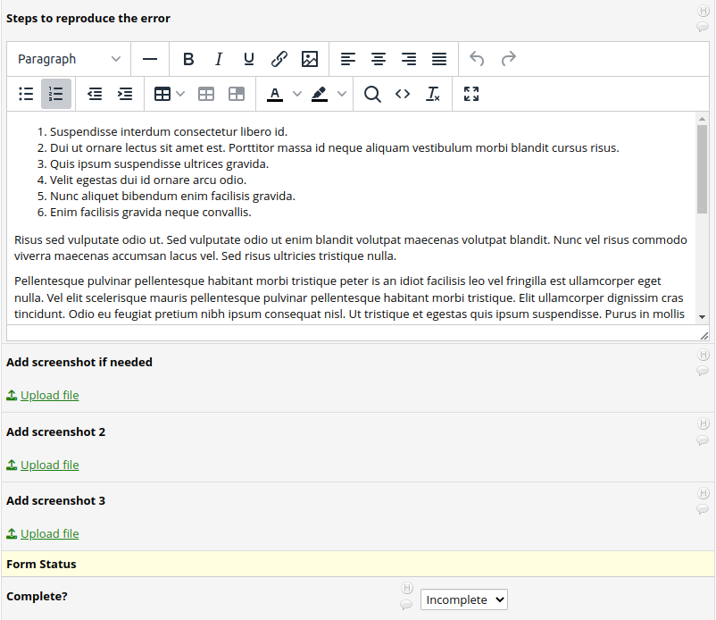
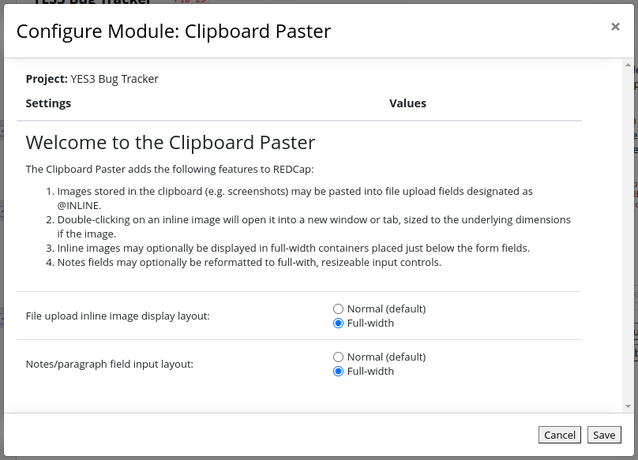

# Clipboard Paster
version 1.0.0  
February 2023  
Peter Charpentier, CRI Web Tools LLC  

## Introduction
The Clipboard Paster was motivated by the need to store and display screenshots on REDCap forms. Our immediate use-case is a "bug and feature tracker" project we are using in our software development efforts. Now, instead of saving screen grabs as files, *figuring out where we saved them* and uploading them in separate steps, we can send them to a bug report form with a single click.

Additional features we required for our bug tracker were to render both the inline images and the notes fields as full-width elements, so that the form could better function as an online report.

## Features
- Images stored in the clipboard (e.g. screenshots) may be pasted into file upload fields designated as @INLINE.
- Double-clicking on an inline image will open it into a new window or tab, sized to the underlying dimensions if the image.
- Inline images may optionally be displayed in full-width containers placed just below the form fields.
- Notes fields may optionally be reformatted to full-with, resizeable input controls.

## Example 

### A simple bug tracking form, without the Clipboard Paster EM

Below is a form for reporting bugs that allows for up to three screenshots. Each of the three screenshot upload fields has been tagged with @INLINE.

### After enabling the Clipboard Paster EM on the project

As you see, the only user interface change is the addition of the 'Paste image' links

### Pasting an image

> The first time you attempt to paste an image into a REDCap upload field, the browser will ask for permission to access the clipboard. You should select the 'allow access' option. If clipboard access is denied or if you mistakenly select 'block access', you will have to manually reset the browser's clipboard access permission setting. See **Allow Browser Clipboard Access** below.

Here I have (1) copied an image from a website and then (2) clicked on the 'Paste image' link. As you see, the image has been stored and is now displayed as an inline image. 

Note that the 'Paste image' link is still present for the upload field into which I just pasted the image, except that it has been reduced to an icon. The link label has been crowded out by the newly-rendered 'Upload new version', 'remove file' and 'Send-it' links.

Note that in this example, I clicked on an image on a web page, right-clicked and selected 'copy image' to place the image in the clipboard. The more common use-case for this feature will be to use a screen grabber like the Windows 'snipping' tool, the PrtSc button or the powerful Greenshot tool (https://getgreenshot.org/). Just take your shot and click the Paste image link!

Next I'll demonstrate the optional form rendering enhancements, but in passing I will first double-click on the inline image. As you see, it opens into a separate browser window sized to fit the original image. 

Now I can more closely examine the image, or move it to another screen as I look over the bug report. Note that this feature is enabled for all inline fields, not just those that contain pasted images.

## Optional enhancements

### The EM configuration settings

The optional enhancements are enabled through the usual EM conguration link, as shown below. Here I have set both to 'enhanced', meaning that I want full-width renderings of both inline images and notes fields.

... and here is what the full treatment looks like! As you see, the inline image now occupies a full row on the form, as do all text fields. I have resized the 'steps to reproduce the error' notes box by dragging the lower-right corner down.

## Allow Browser Clipboard Access

If you receive a "No clipboard access" message whilst attempting a paste, you must manually reset this browser setting. Instructions for various browsers are shown below.

### Chrome

1. Open Chrome browser Settings.

2. Select Security & Privacy > Site Settings > Permissions > Clipboard.

3. Select Allow. 

### Edge

1. Select the lock icon in the address bar.

2. Change the Permissions for this site > Clipboard setting to Allow

### Firefox

(content to be added)

### Safari

(content to be added)

## Error handling

### Paste errors

The clipboard can store any sort of object, and so if the last thing you copied was not an image, or if there's nothing in the clipboard, you will behold this message:

The message box will go away after 10 seconds, or if you click on it.

All 'handled' Clipboard Paster errors will generate messages as above. If an unhandled condition is encountered, please get back to us at redcap@yale.edu.

# How it works

When the REDCap form is rendered:

1. If the full-width image view is selected in the EM settings, full-width containers are injected below each upload field marked with the @INLINE tag.

2. If the full-width notes field is selected in the EM settings, fuill-width containers are injected below each notes field, and the textarea input controls are relocated to them.

3. A 'mutation monitor' process is launched, that checks for changes in the UI such as new inline image renderings. The interval between mutation checks is 100ms.

When the 'paste image' link is clicked, the following actions ensue:

1. The contents of the clipboard are fetched by the Clipboard Web API (https://developer.mozilla.org/en-US/docs/Web/API/Clipboard/read) and converted to a base64-encoded string using the FileReader Web API (https://developer.mozilla.org/en-US/docs/Web/API/FileReader/readAsDataURL).

2. The REDCap popup upload form is opened by a call to the REDCap function filePopup().

3. The popup upload form input 'myfile_base64' is populated with the base64-encoded string from (1).

4. The form's submit event is triggered programmatically.

5. REDCap uploads the image string, and then renders it as an inline image.

6. Within 100ms the mutation monitor will pick up the newly-rendered image, and if the enhanced image view option is configured in the EM settings, will relocate the image to the full-width image container.

