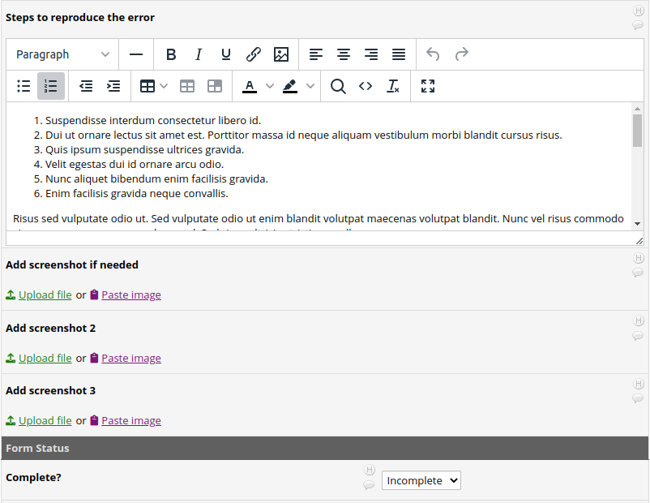
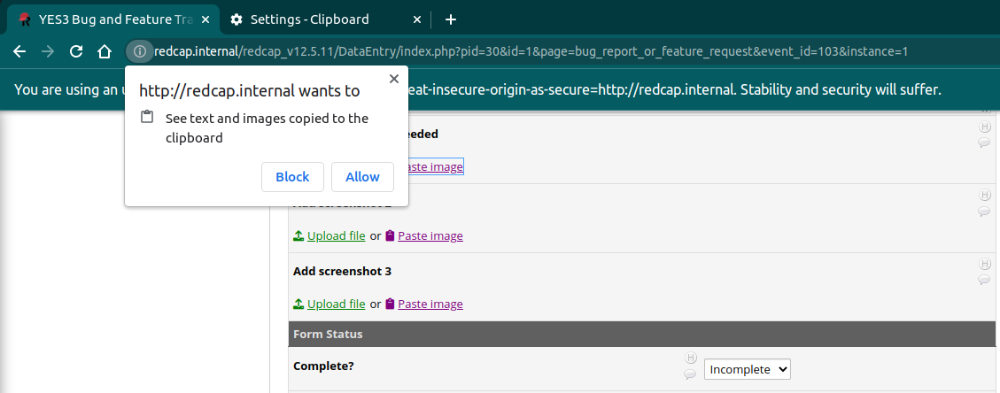
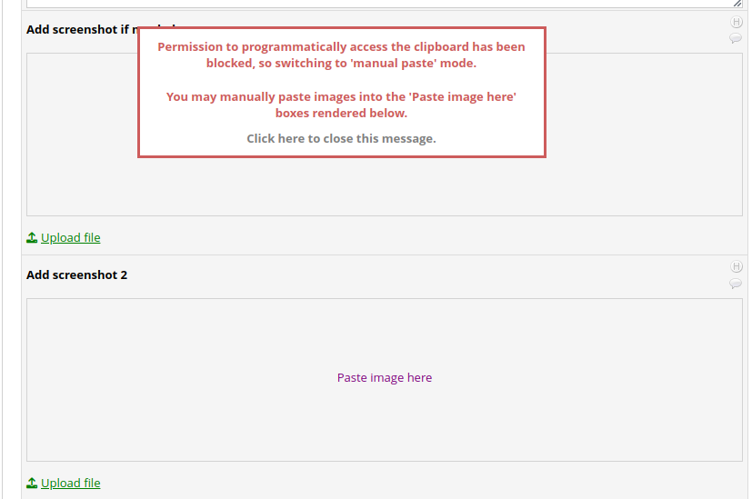
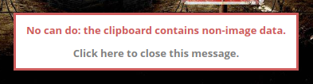

# Clipboard Paster
version 1.0.0  
February 2023  
Peter Charpentier, CRI Web Tools LLC / Yale University

## Introduction
The Clipboard Paster was motivated by the need to store and display screenshots on REDCap forms. Our immediate use-case is a "bug and feature tracker" project we are using in our software development efforts. Now, instead of saving screen grabs as files, *figuring out where we saved them* and uploading them in separate steps, we can send them to a bug report form with a single click.

## Features
- Images stored in the clipboard (e.g. screenshots) may be pasted into file upload fields designated as @INLINE.
- Double-clicking on an inline image will open it into a new window or tab, sized to the underlying dimensions if the image.
- Support for new action tags @USER-FIRSTNAME, @USER-LASTNAME and @USER-EMAIL, for autopoulating REDCap form fields

## Browser support
We have tested the Clipboard Paster on Chrome, Edge, Firefox and Safari. 

## Example 

### A simple bug tracking form, without the Clipboard Paster EM

Below is a section of a form for reporting bugs that allows for up to three screenshots. Each of the three screenshot upload fields has been tagged with @INLINE.

### After enabling the Clipboard Paster EM on the project

As you see, the only user interface change is the addition of the 'Paste image' links

### How the UI changes on browsers that require user action to paste
The Clipboard Paster relies on a relatively new browser technology - the Clipboard API - to paste images. Certain browsers, notable Firefox, do not fully support the Clipboard API and require user action for pasting from the clipboard. If the Clipboard Paster detects incomplete support for the Clipboard API, it will render a slightly different user interface (UI).

As you see, instead of a paste *link*, the UI presents a paste *box*, into which the user must paste the image. There are a couple of ways to do this. One is to click on 'Paste image here' and then press Ctlr-V (or Command-V for MacOS) to paste. Or, you may *right*-click anywhere in the box and select 'paste' from the popup context menu.

### Pasting an image

> The first time you attempt to paste an image into a REDCap upload field on a browser that supports the Clipboard API (Chrome, Edge, Safari), the browser will ask for permission to access the clipboard. You should select the 'allow' option. 

If you decline to allow access, the REDCap user interface will adjust by switching to 'manual paste mode', illustrated in the scheenshot below and explained above under **How the UI changes on browsers that require user action to paste**.

If you mistakenly selected 'block access', you will have to manually reset the browser's clipboard access permission setting. See **Allow Browser Clipboard Access** below.

Below is a screenshot of a pasted image rendering. 

Note that in this example, I clicked on an image on a web page, right-clicked and selected 'copy image' to place the image in the clipboard. The more common use-case for this feature will be to use a screen grabber like the Windows 'snipping' tool, the PrtSc button or the powerful Greenshot tool (https://getgreenshot.org/). Just take your shot and click the Paste image link!

Once the image is rendered, double-clicking on it will open a pop-up window sized to the underlying dimension of the image 

Now I can more closely examine the image, or move it to another screen as I look over the bug report. Note that this feature is enabled for all inline fields, not just those that contain pasted images.

## Allow Browser Clipboard Access

If you receive a "No clipboard access" message whilst attempting a paste, you must manually reset this browser setting. Instructions for various browsers are shown below.

### Chrome

1. Open Chrome browser Settings.

2. Select Security & Privacy > Site Settings > Permissions > Clipboard.

3. Select Allow. 

### Edge

1. Select the lock icon in the address bar.

2. Change the Permissions for this site > Clipboard setting to Allow

## Error handling

### Attempting to paste non-image data

The clipboard can store any sort of object, and so if the last thing you copied was not an image, or if there's nothing in the clipboard, you will behold this message:

The message box will go away after 10 seconds, or if you click on it.

### Beware the zombie apocalypse
Let us know immediately if you encounter the following:

This is actually pretty serious, as it indicates a runaway situation - no doubt caused by a serious coding error wrought by yous truly - in which the Clipboard Paster EM is repeatedly creating and/or destroying some UI element; a loop that can significantly degrade performance. This condition is detected through a module that detects and reacts to UI "mutations" caused by user actions like pasting or removing uploaded images. When too many mutation reactions are observed over a period of time, a "mutation kill switch" is activated. This stops the UI mutation/reaction processes, which will effectively shut down the Clipboard Paster EM for the form. In all likelihood this demented message will never pop up. But if it does please let us know ASAP.

### Other errors ###

All 'handled' Clipboard Paster errors - including browser permission errors - will generate messages as above. If an unhandled condition is encountered, you may not always be made aware of it other than by observing problems like not being able to paste images. However a diagnostically useful message should be output to the Javascript Console, which you can access through F12 or by right-clicking on the REDCap form and selecting 'inspect'. Please get back to us at redcap@yale.edu, with a screenshot of the Javascript Console if possible.

# Technical Appendix 

## How it works

### When the REDCap form is rendered ##

A 'mutation monitor' process is launched. The mutation monitor reacts to newly-rendered inline images, and fields that have been newly hidden or displayed via branching rules. The interval between mutation checks is 100ms.

### When the 'paste image' link is clicked ##

1. The contents of the clipboard are fetched by the Clipboard Web API (https://developer.mozilla.org/en-US/docs/Web/API/Clipboard/read) and converted to a base64-encoded string using the FileReader Web API (https://developer.mozilla.org/en-US/docs/Web/API/FileReader/readAsDataURL).

2. The REDCap popup upload form is opened by a call to the REDCap function filePopup().

3. The popup upload form input 'myfile_base64' is populated with the base64-encoded string from (1).

4. The form's submit event is triggered programmatically.

5. REDCap uploads the image string, and then renders it as an inline image.

6. Within 100ms the mutation monitor will pick up the newly-rendered image, and perform a couple of minor UI adjustments (injecting paste links, disabling paste boxes if Firefox, ...).

